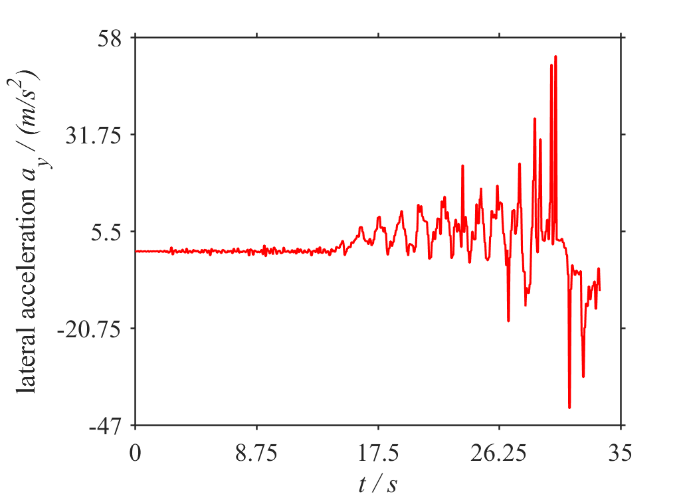
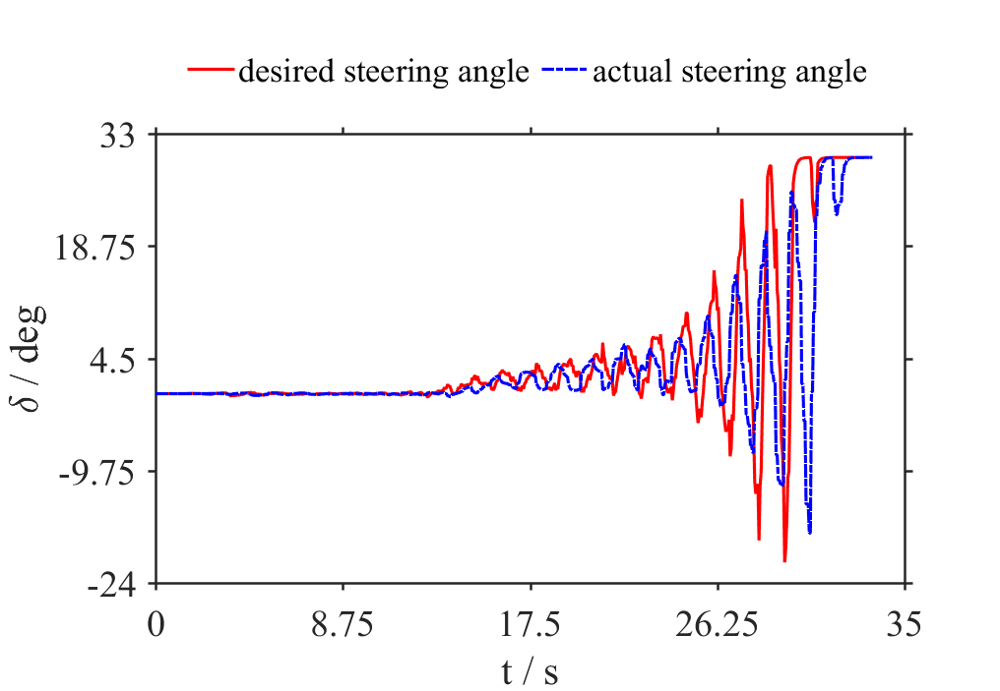

# easy_plot

This repository gives examples for better plotting configuration in Matlab and Python. It is not a tutorial but an exhibition to show you some interesting usages when I'm working on daily figure processing. I will also give a list of references for further exploration.

## Quick Start

### basic_example: how to change figure properties

There are two ways to change a figure's properties, one is to change the default settings which is a permanent approach, the other is to change the properties of the specific figure directly. If you are afraid of making a mess by changing the default settings, you may like the second one, and it is recommended to do this by calling a user-defined function by yourself if you have to configure lots of properties for each single figure, which leads to clean code styles.

- [basic_example](src/matlab/basic_example/basic_example.m) gives you an example using the second approach to change figures' properties.


### fig_plot: advanced figure plot example

[fig_plot](src/matlab/fig_plot/fig_plot.m) is an example to show how to plot figure based on csv file in a batch approach. Figure property configuration is similar to [basic_example](src/matlab/basic_example/basic_example.m).

Parameter configuration:
- `save_enable_xx`: whether to save certain figure to file or not.
- `image_path`: choose the path to save your figure. The default setting is the current folder.
- `global_path_file` and `state_name`: the path to search certain groups of files.

And it is worth noting that you can set the color of your figure specified as an RGB triplet in Matlab. You can see `how to choose color` below for more recommendation to choose color.

```matlab
% plot color setting
plot(time,des_delta,...
                'LineStyle','-',...
                'LineWidth',1.5,...
                'Color',[189, 189, 189] / 255,... % you can also use 'r', 'g' etc. to call for the short name of built-in colors.
                'MarkerEdgeColor','b',...
                'MarkerFaceColor','b',...
                'MarkerSize',5), hold on;

% current axis color setting
ax1 = gca;
ax1.Color = [239, 237, 245] / 255;
```

### fig_splice: automatic figure splicing

This function can dramatically reduce our efforts to put some figures into one single figure in a batch approach. Here is an example when I am trying to compose four images into a 2x2 single image. Let's see the inputs



and the output:


You can also set the columns of the output image and whether or not cutting image edges by using the function script [spliceFigureFunc.m](src/matlab/fig_splice/spliceFigureFunc.m). To see one example of how to realize this, just have a look at [figure_splice.m](src/matlab/fig_splice/figure_splice.m).

## how to choose color

There are some tools to choose color used in your figure, which makes your plots more beautiful.

- [ColorBrewer2](http://colorbrewer2.org/)
- [Adobe Color](https://color.adobe.com/zh/create/image/)

|`colorbrewer2`|`Adobe Color`|
|:------------:|:-----------:|
|||

Here is a comparison by using built-in color and color found on the website ColorBrewer2:

|`using built-in color`|`using color in ColorBrewer2`|
|:------------:|:-----------:|
|||

## Dependencies

* Python > 3.0
* Matlab > 2014b

## to-do

- [ ] Python version (coming soon)

## Contributing

If you have any questions or ideas to improve it, just submit issues or PRs to this repo, and I would say thanks for your contribution.

## Acknowledgement

Thanks to Mr. Mie (咩先生) @科研充电宝 (one offical account on WeChat aiming at sharing various research tricks) for providing the original version of figure splicing based on which I improved and formulated the demonstration of fig_splice.
