# easy_plot

This repository gives examples for better plotting configuration in Matlab and Python. It is not a tutorial but an exhibition to show you some interesting usages when I'm working on daily figure processing. I will also give a list of references for further exploration.

## Table of Contents

   * [easy_plot](#easy_plot)
      * [Quick Start (Matlab)](#quick-start-matlab)
         * [basic_example: how to change figure properties](#basic_example-how-to-change-figure-properties)
         * [fig_plot: advanced figure plot example](#fig_plot-advanced-figure-plot-example)
         * [fig_splice: automatic figure splicing](#fig_splice-automatic-figure-splicing)
      * [Quick Start (Python)](#quick-start-python)
         * [basic_example: how to change figure properties](#basic_example-how-to-change-figure-properties-1)
         * [fig_plot: advanced figure plot example](#fig_plot-advanced-figure-plot-example-1)
      * [how to choose color](#how-to-choose-color)
      * [Dependencies](#dependencies)
      * [to-do](#to-do)
      * [Contributing](#contributing)
      * [Acknowledgement](#acknowledgement)

## Quick Start (Matlab)

### basic_example: how to change figure properties

There are two ways to change a figure's properties, one is to change the default settings which is a permanent approach, the other is to change the properties of the specific figure directly. If you are afraid of making a mess by changing the default settings, you may like the second one, and it is recommended to do this by calling a user-defined function by yourself if you have to configure lots of properties for each single figure, which leads to clean code styles.

- [basic_example](src/matlab/basic_example/basic_example.m) gives you an example using the second approach to change figures' properties.


### fig_plot: advanced figure plot example

[fig_plot](src/matlab/fig_plot/fig_plot.m) is an example to show how to plot figure based on csv file in a batch approach. Figure property configuration is similar to [basic_example](src/matlab/basic_example/basic_example.m).

Parameter configuration:
- `save_enable_xx`: whether to save certain figure to file or not.
- `image_path`: choose the path to save your figure. The default setting is the current folder.
- `global_path_file` and `state_name`: the path to search certain groups of files.

And it is worth noting that you can specify the color of your figure as an RGB triplet in Matlab. See `how to choose color` below for more recommendation to choose harmonious color.

```matlab
% plot color setting
plot(time,des_delta,...
                'LineStyle','-',...
                'LineWidth',1.5,...
                'Color',[189, 189, 189] / 255,... % you can also use 'r', 'g' etc. to call for the short name of built-in colors.
                'MarkerEdgeColor','b',...
                'MarkerFaceColor','b',...
                'MarkerSize',5), hold on;

% current axis color setting
ax1 = gca;
ax1.Color = [239, 237, 245] / 255;
```

### fig_splice: automatic figure splicing

This function can dramatically reduce our efforts to put some figures into one single figure in a batch approach. Here is an example when I am trying to compose four images into a 2x2 single image. Let's see the inputs

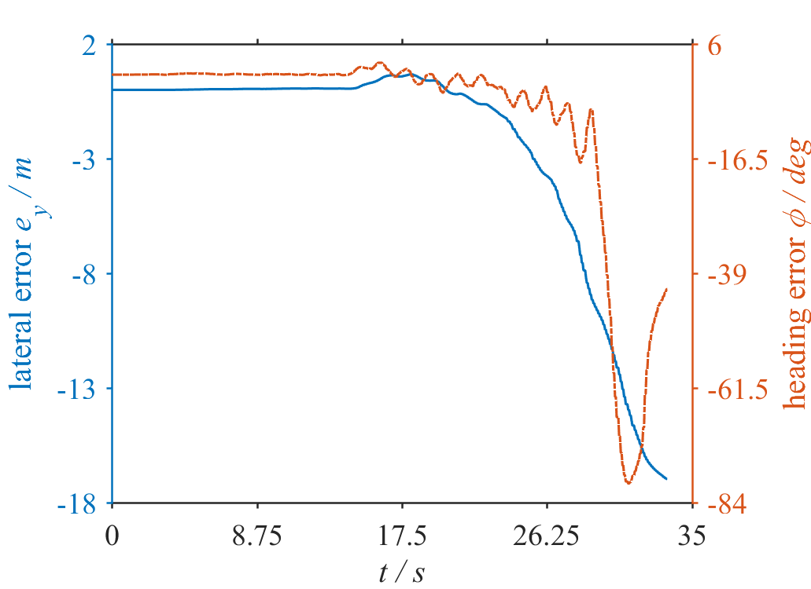

and the output:

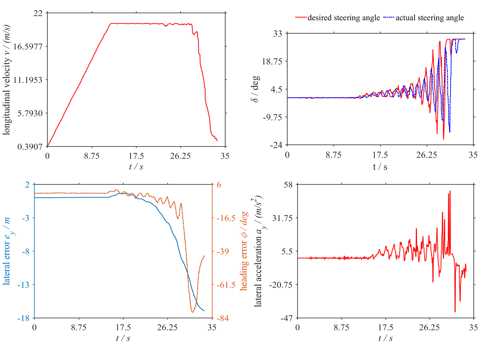

You can also set the columns of the output image and whether or not cutting image edges by using the function script [spliceFigureFunc.m](src/matlab/fig_splice/spliceFigureFunc.m). To see one example of how to realize this, just have a look at [figure_splice.m](src/matlab/fig_splice/figure_splice.m).

## Quick Start (Python)

Using Python package Matplotlib, Pandas, Numpy and other packages, you can also get similar plot, and even more convenient configuration.

### basic_example: how to change figure properties

- [basic_example](src/python/basic_example/basic_example.py) gives you an example using the second approach to change figures' properties.


### fig_plot: advanced figure plot example

[fig_plot](src/python/fig_plot/fig_plot.py) is an example to show how to plot figure based on csv file in a batch approach.

Parameter configuration:
- `save_enable`: whether to save figures to file or not.
- `image_path`: choose the path to save your figure. The default setting is the current folder.
- `global_path_file`, `search_path` and `filename`: the path to search certain groups of files.
- `fig_dpi` and `figsize_inch`: figure size and resolution.

And it is worth noting that you can specify the color of your figure as an RGB triplet (or hex codes) in Python. See `how to choose color` below for more recommendation to choose harmonious color.

Here have a look at the results:

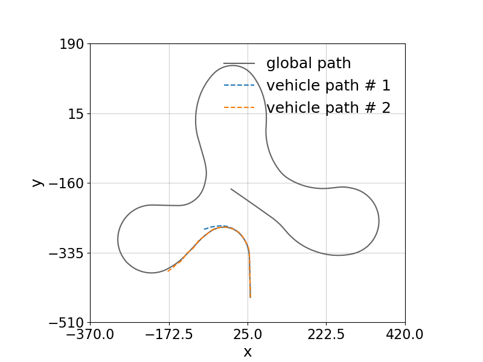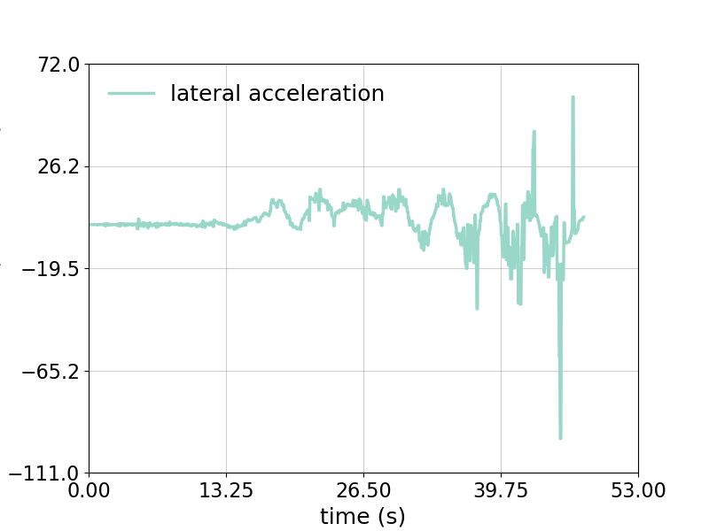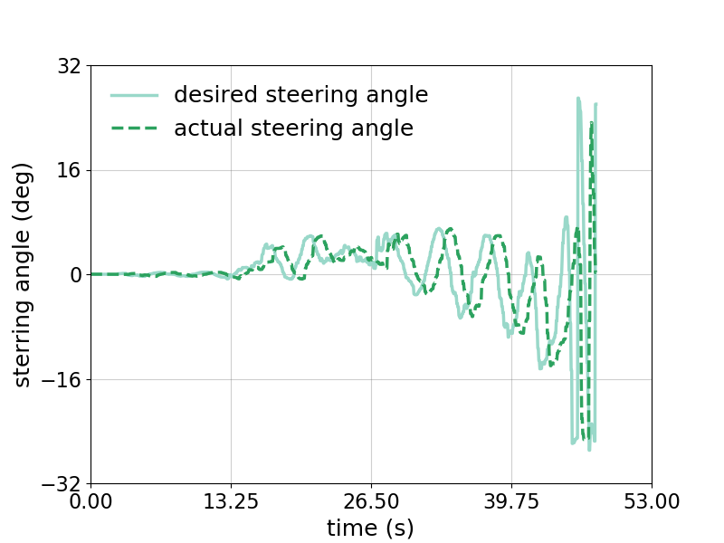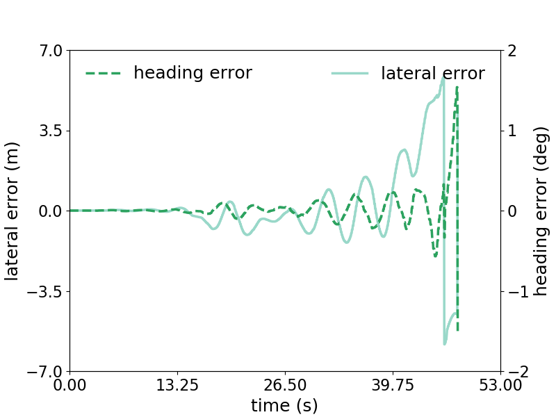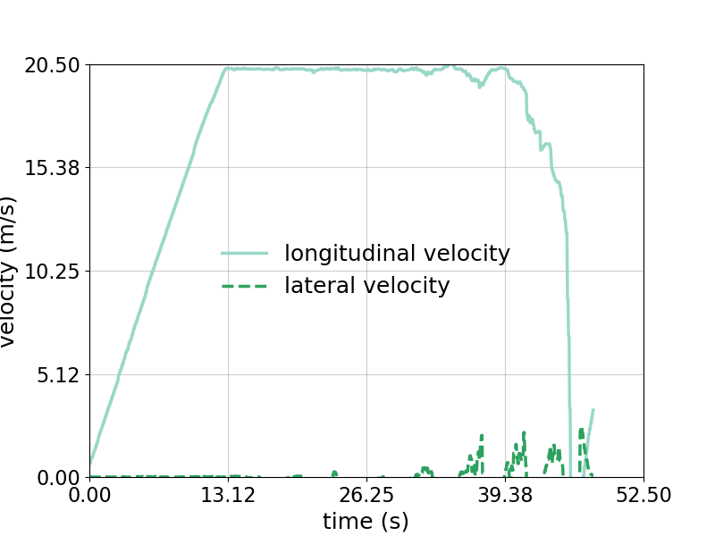

## how to choose color

There are some tools for guidance in choosing color schemes, which makes your plots more beautiful.

- [ColorBrewer2](http://colorbrewer2.org/)
- [Adobe Color](https://color.adobe.com/zh/create/image/)

|                        `colorbrewer2`                        |                        `Adobe Color`                         |
| :----------------------------------------------------------: | :----------------------------------------------------------: |
| 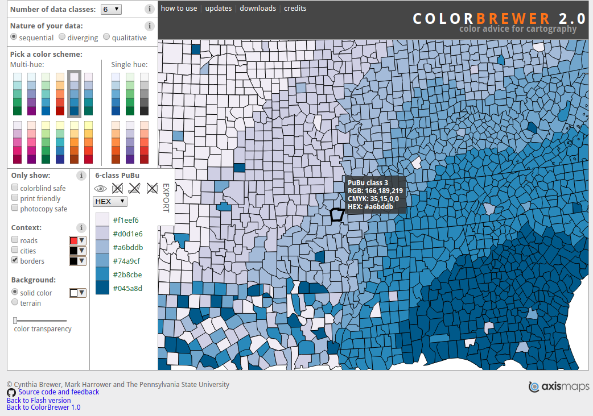 | 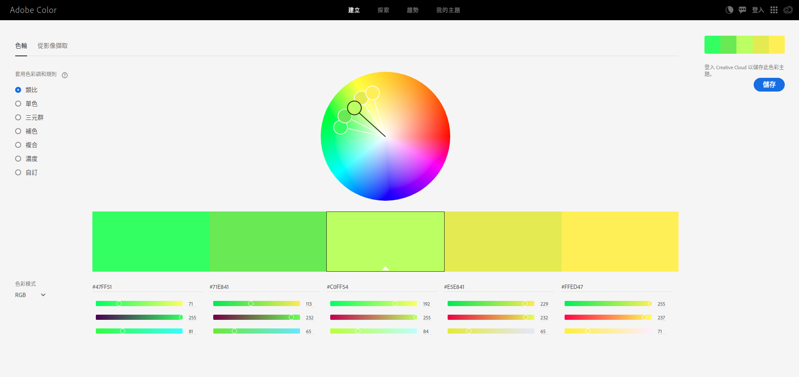 |

Here is a comparison by using built-in color and color chosen from ColorBrewer2:

|`using built-in color`|`using color in ColorBrewer2`|
|:------------:|:-----------:|
|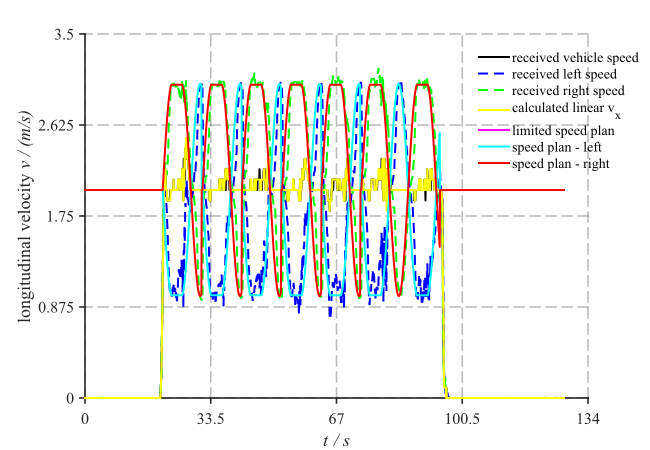|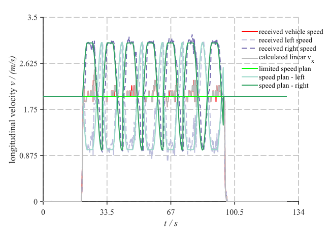|

## Dependencies

* Python > 3.0
* Matlab > 2014b

## to-do

- [ ] Python version
  - [x] basic_example
  - [x] fig_plot
  - [ ] fig_splice
- [ ] 3D Plot
- [ ] Contour Plot
- [ ] Image Show

## Contributing

If you have any questions or ideas to improve it, just submit issues or PRs to this repo, and I would say thanks for your contribution.

## Acknowledgement

Thanks to Mr. Mie (咩先生) @科研充电宝 (one offical account on WeChat aiming at sharing various research tricks) for providing the original version of figure splicing based on which I improved and formulated the demonstration of fig_splice.
